

# PeeWee Rover Light
Jednoduché a levné PeeWee vozítko pro Micro:bit. Jedná se o OpenHardware platformu vyvinutou pro podporu projektové výuky v předmětech jako Programování, Algoritmizace, Informatické myšlení a podobně.

Bez dalších modifikací je vozítko určeno pro programování pomocí MakeCode (Blockly / Static TypeScript) s mikrokontrolérem Micro:bit, lze jej ale snadno adaptovat i na libovolný jiný mikrokontrolér (Arduino, ESP32 atd.).

## O projektu
Systém je navržen s ohledem na:
- **Mechanickou robustnost**.
- **Opakovatelnost stavby:** Dražší komponenty je možné používat opakovaně. Levné položky, jako jsou 3D tištěné díly a kabely, stojí řádově desetikoruny. Další studenti tak mohou stavbu bez potíží opakovat od výchozího stavu z rozložených součástek.
- **Mezipředmětové vazby:** Ideální pro propojení oborů jako polytechnika, algoritmizace, elektrotechnika, fyzika, multimédia, matematika a další.

## Hardware a konstrukce
Základem je 3D tištěné šasi, které je osazené dvěma DC130 motory s TT převodovkou, dvěma koly a zadním vláčeným kolečkem (ocelová kulička otočná v 360°). 

Napájení je zajištěno z 2S 7,4V battery packu. Jako zdroj napájení a řízení motorů slouží modul motor driver L298N. Pro řízení logiky je použit Micro:bit připojený do desky IObit pro snadnější propojení GPIO z mikrokontroléru.

**Osvětlení (WS2812B):**
Na vozítku je připevněno celkem 9 adresovatelných RGB LED diod.
- 5 směřuje dozadu (B - Back)
- 1 směřuje vlevo (L - Left)
- 1 směřuje vpravo (R - Right)
- 2 směřují vpřed (F - Front)

Fyzické řazení diod v sérii je: **F - R - B - B - B - B - B - L - F**

## Schéma a návod ke stavbě
- **Zjednodušené schéma elektrického zapojení:** [schema.svg](schema.svg) (nebo [schema.pdf](schema.pdf))
- **Videonávod ke stavbě:** Vzhledem k aktualizacím je k dispozici na stálém přesměrování [https://go.pslib.cz/buildpeewee](https://go.pslib.cz/buildpeewee)

## Software / Programování
Ovládací knihovna (rozšíření) pro prostředí MakeCode je k dispozici v repozitáři: 
[https://github.com/microbit-cz/pxt-peewee-light](https://github.com/microbit-cz/pxt-peewee-light)

## Podklady pro výrobu
Data pro 3D tisk: [PeeWeeLight.3mf](model/PeeWeeLight.3mf)

Referenční sestava: [PeeWeeLightAssembly.stl](model/PeeWeeLightAssembly.stl) 

## Obrázky

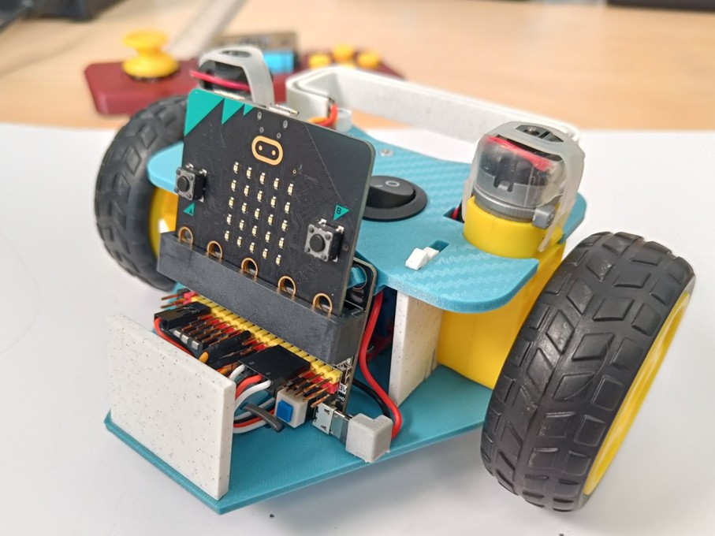

## Seznam dílů

| Množství | Cena | Díl | Náhled |
|:--------:|-----:|-----|:------:|
| 1× | – | [Micro:bit](https://microbit.org/buy/) | 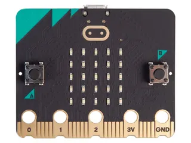 |
| 1× | 127 Kč | [IObit V2.0 rozšiřující deska](https://www.aliexpress.com/w/wholesale-microbit-board-IOBIT.html) | 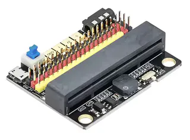 |
| 2× | 73 Kč | [130 DC motor s TT převodovkou 1:48](https://www.aliexpress.com/w/wholesale-TT-gear-motor.html) | 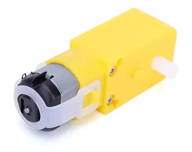 |
| 2× | 42 Kč | [65mm žluté kolo](https://www.aliexpress.com/w/wholesale-tt-gear-wheels-65mm.html) | 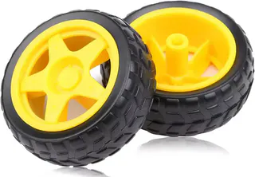 |
| volitelně 2× | 48 Kč | [65mm šedé kolo 6514 s lepší přilnavostí](https://www.aliexpress.com/w/wholesale-6514-wheel.html) | 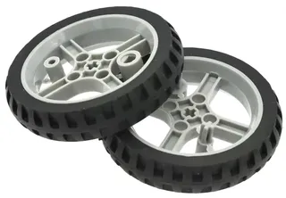 |
| 1× | 62 Kč | [L298N H-můstek – ovladač motorů](https://www.aliexpress.com/w/wholesale-L298N-Driver-Board-Module.html) | 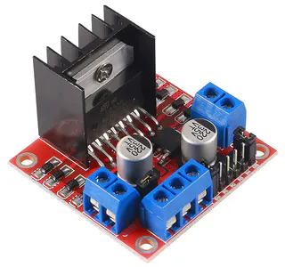 |
| 1× | 24 Kč | [18650 2S držák baterií](https://www.aliexpress.com/w/wholesale-18650-battery-holder.html) | 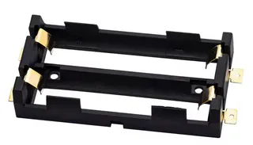 |
| 2× | 110 Kč | [18650 baterie](https://www.aliexpress.com/w/wholesale-18650-battery.html) | 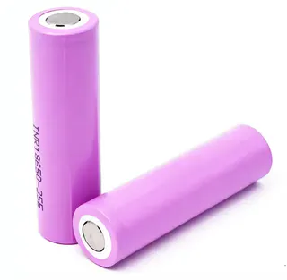 |
| 1× | 33 Kč | [USB-C 2S BMS nabíjecí modul](https://www.aliexpress.com/w/wholesale-Type%2525252dC-USB-2S-BMS-15W-charger.html) | 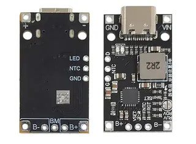 |
| 1× | 17 Kč | [ocelové kulové otočné kolečko](https://www.aliexpress.com/w/wholesale-Vacuum-W420-Steel-Ball-Universal-Wheel.html) | 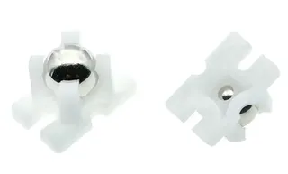 |
| 9× | 11 Kč | [WS2812B LED (pásek 60 LED/m, IP30)](https://www.aliexpress.com/w/wholesale-WS2812B-60-LED.html) | 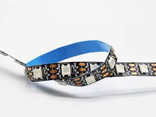 |
| 15× | 7 Kč | [Dupont female konektory](https://www.aliexpress.com/w/wholesale-Dupont-2.54mm-TJC8%2525252dT%2525252dD.html) | 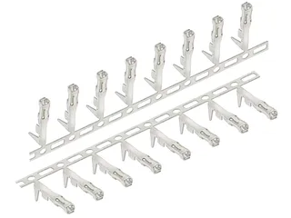 |
| 2× | 1 Kč | [Dupont 4PIN plastové pouzdro 2,54mm](https://www.aliexpress.com/w/wholesale-Dupont-4PIN-plastic-housing-2.54mm.html) |  |
| 1× | 0,50 Kč | [Dupont 2PIN plastové pouzdro 2,54mm](https://www.aliexpress.com/w/wholesale-Dupont-2PIN-plastic-housing-2.54mm.html) |  |
| 1× | 11 Kč | [20cm prodlužovací servo kabel](https://www.aliexpress.com/w/wholesale-20cm-Servo-Extension-Cable-30-core.html) |  |
| – | 15 Kč | [37cm 26AWG silikonový servo kabel](https://www.aliexpress.com/w/wholesale-servo-cable-wire-26AWG-30-Core.html) |  |
| – | 6 Kč | [20cm 20AWG 2PIN silikonový kabel](https://www.aliexpress.com/w/wholesale-20cm-20AWG-Silicone-Wire.html) |  |
| 1× | 11 Kč | [Micro-USB Male 2Pin konektor s připájenými vodiči](https://www.aliexpress.com/w/wholesale-Micro-USB-Male-JACK-2Pin-Welding-Wire.html) |  |
| 1× | 6 Kč | [20mm kulatý kolébkový vypínač snap-in](https://www.aliexpress.com/w/wholesale-round-snap%2525252din-mini-Rocker-Switch.html) | 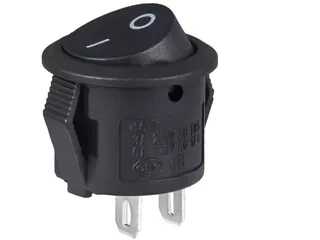 |
| 6× | 2 Kč | [stahovací pásek 3×100mm](https://www.aliexpress.com/w/wholesale-Self%2525252dLocking-Zip-Ties-3x100.html) |  |
| – | 2 Kč | [smršťovací bužírka 2mm/3mm](https://www.aliexpress.com/w/wholesale-heatshrink-tube.html) |  |
| 6× | 4 Kč | [šroub M3×6mm PH DIN 7985](https://eshop.killich.cz/detail/sroub-m3x6-zinek-4-8-pulkulata-hlava-krizova-drazka-ph-din-7985) |  |
| 6× | 4 Kč | [šroub do plastu 2,2×5mm](https://eshop.killich.cz/detail/sroub-do-plastu-2-2x5-f-zinek-pulkulata-hlava-krizova-drazka-pz-tupy-plasfast-30) |  |

*Celková cena:* cca 570 Kč (bez micro:bitu a dílů pro 3D tisk)